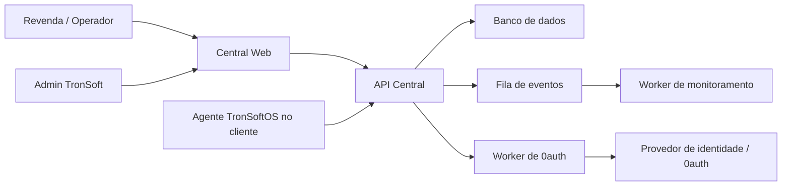

# Arquitetura Inicial

## Visao geral



## Central Web

Interface usada por revendas e administradores para:

- visualizar indicadores;
- cadastrar clientes;
- consultar ambientes;
- acompanhar alertas;
- administrar usuarios e permissoes.

## API Central

Camada principal do sistema. Responsabilidades:

- regras de negocio;
- multi-tenant por revenda;
- cadastro de clientes e ambientes;
- ingestao de eventos dos agentes TronSoftOS;
- exposicao de dados para a Central Web;
- publicacao de trabalhos em fila;
- comunicacao com o worker de 0auth.

## Worker de 0auth

Servico separado para rotinas de identidade. Responsabilidades iniciais:

- processar criacao e vinculacao de identidades;
- renovar, validar ou revogar tokens quando aplicavel;
- sincronizar permissoes entre Central e provedor de identidade;
- emitir eventos de auditoria de autenticacao/autorizacao;
- isolar fluxos sensiveis da API principal.

Observacao: o nome `0auth` foi mantido conforme a definicao inicial. Se a intencao tecnica for OAuth/OIDC, este worker pode evoluir para encapsular esses fluxos.

## Worker de monitoramento

Processa eventos recebidos dos ambientes TronSoftOS:

- normaliza sinais;
- calcula status;
- gera alertas;
- atualiza ultima comunicacao;
- dispara notificacoes futuras.

## Banco de dados

O modelo deve preservar isolamento por revenda. Toda entidade operacional sensivel deve ter uma trilha clara de propriedade:

```text
revenda -> cliente -> ambiente -> eventos/alertas
```

## Principios

- Separar autenticacao/autorizacao do processamento operacional.
- Registrar eventos antes de transformar dados de monitoramento.
- Fazer multi-tenant desde o primeiro desenho.
- Evitar acoplamento direto entre revendas.
- Guardar historico suficiente para auditoria e suporte.

